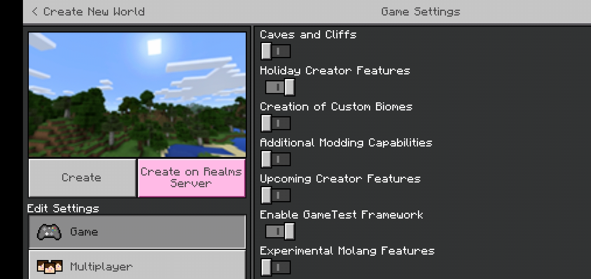
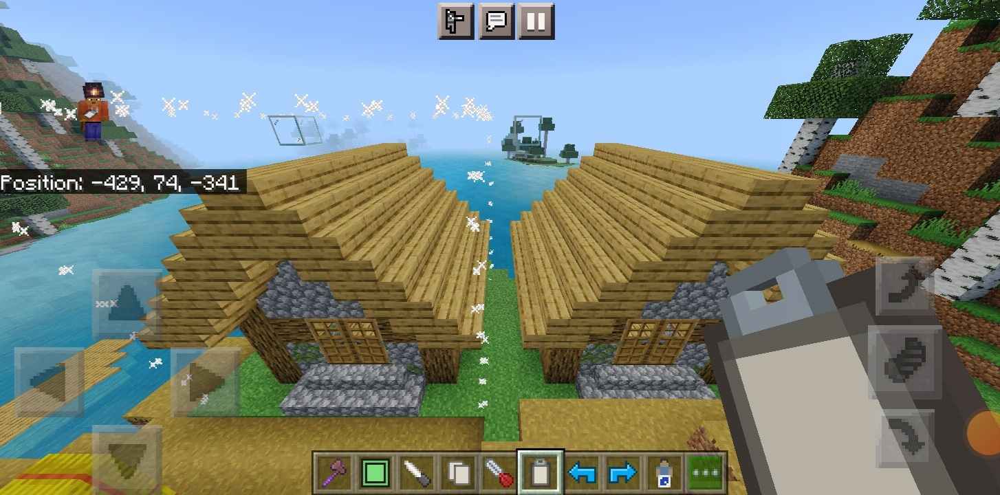
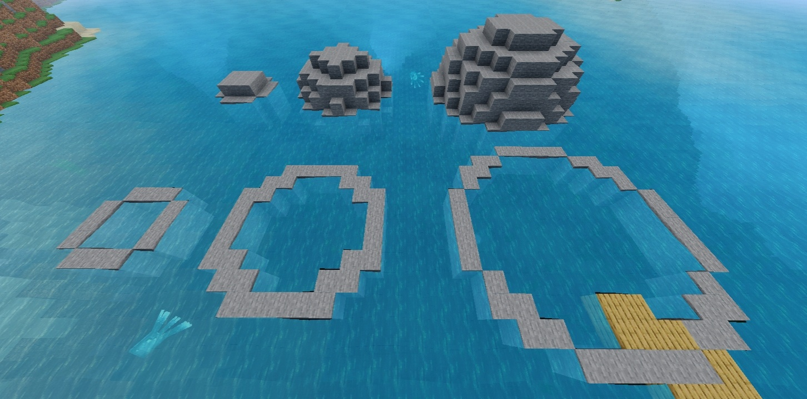

# WorldEdit: Bedrock Edition

This is a Minecraft Bedrock addon port of the famous WorldEdit mod for Minecraft: Java Edition. The addon comes with custom commands to make building easier, and more fun! Not only are there commands, but also items to make it easier for anyone on any device to use this.
__Please note that this addon is currently in its beta stage, and requires experimental features. To be on the safe side, make a backup of your world.__

## Installation
### Locally
First you must download the mcaddon file. You can find one in the [release section](https://github.com/SIsilicon/WorldEdit-BE/releases). After which, you open it with Minecraft and it will be imported into your game. Once there, choose a world you want to apply this addon to, and add the behaviour pack (the resource pack should apply automatically). The "Holiday Creator Features" and "GameTest Framework" experimental features must also be enabled.

And that's it! Your world is ready for WorldEdit.

### Aternos server
To properly add this addon to the server, you first need to upload an already existing world with the required experimental features enabled (Do NOT add the addon to the world directly). You must then install the addon separately in the server's `packs` folder. Read more about how aternos handles addons and experimental features [here](https://support.aternos.org/hc/en-us/articles/360042095232-Installing-Addons-Minecraft-Bedrock-Edition-) and [here](https://support.aternos.org/hc/en-us/articles/4407553257873-Enabling-experimental-gameplay-Minecraft-Bedrock-Edition-).

## Features
<!---->
WorldEdit currently has the following features.
- Clipboard manipulation (Cut, Copy, Paste)
- Masking blocks from certain actions
- Maniuplating region selections
- Navigation commands and the Navigation Wand
- Generating shapes
- Multiblock patterns
- Undo and Redo
- Brushes for painting/affecting blocks

## Planned
These features will be added in the near future.
- More brushes and tools
- More selection shapes
- More selection operations
- Manipulate biome data
- Basically, Java Parity

## Documentation
The addon comes with a quick start on how to use WorldEdit in `Settings > How to Play` while you're in the world.
There's a more in-depth documentation over at the project's docs page: https://worldedit-be-docs.readthedocs.io

## Contribution
### Bug Report
If you've encountered a bug with the addon, please go [here](https://github.com/SIsilicon/WorldEdit-BE/issues/new?template=bug_report.md) submit one.

### Feature Request
The aim of this project is to replicate as many of the original WorldEdit features as possible, so if there's a feature you want that's in the original mod, it will likely be implemented anyway if possible.
However, you can still propose features that _aren't_ in the original mod, so long as you can make a case for how useful it can be. Then the proposal will be considered.

You submit proposals [here](https://github.com/SIsilicon/WorldEdit-BE/issues/new?template=feature_request.md). Make sure that a similar proposal has not been made already.

## License
This addon is under the [GPLv3 license](LICENSE.txt). This means that you:
- CAN modify, copy and distribute this addon.
- CAN use it privately or for commercial use.
- CAN'T change the license of your modified version.
- CAN'T make the modified source code closed.
- HAVE TO indicate any changes in the modified version.

You also don't HAVE to credit me, but it would be great if you did to help support my work! 😁

## Special Thanks
The backbone of this addon's code is a heavily modified version of notbeer's [GameTest API Wrapper](https://github.com/notbeer/Gametest-API-Wrapper).

And thanks to the original creator of the WorldEdit mod "sk89q" and [EngineHub](https://enginehub.org/) as a whole. They developed and excellent mod, and I'm just simply making a version of it work on bedrock. They're the real heroes. :) 

## Support
I know you already saw the badge at the top, but it took time and effort to make this addon, so if you can, please support me by becoming a [Patreon](https://patreon.com/SIsilicon), or donating via [PayPal](https://www.paypal.com/cgi-bin/webscr?cmd=_s-xclick&hosted_button_id=XXXJ5ETNT5PSN)!
