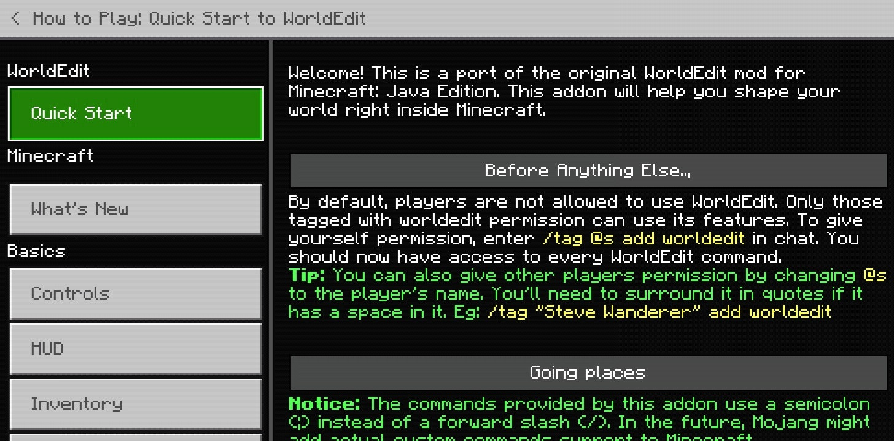

# WorldEdit: Bedrock Edition
This is a Minecraft Bedrock addon port of the famous WorldEdit mod for Minecraft: Java Edition. The addon comes with custom commands to make building easier, and more fun! Not only are there commands, but also items to make it easier for anyone on any device to use this.
__Please note that this addon is currently in its beta stage, and requires experimental features. To be on the safe side, make a backup of your world.__

## Installation
First you must download the mcaddon file. You can find one in the release section. After which, you open it with Minecraft and it will be imported into your game. Once there, choose a world you want to apply this addon to, and add the behaviour pack and resource pack together. The following experimental features must also be enabled.

And that's it! Your world is ready for WorldEdit.

## Usage
The game will come with instructions on how to use WorldEdit in the How to Play section in settings while you're in the world.

## Features
- Clipboard manipulation (Cut, Copy, Paste)
- Making cuboid region selections
- Navigation commands and the Navigation Wand
- Generating shapes
- Multiblock patterns
- Undo and Redo
- Filling selections

## Planned
- Masks
- Brushes
- More tools and items
- More selection shapes
- More selection operations
- More sophisticated patterns
- No limit to selection size

## Special Thanks
Thanks to the original creator of the WorldEdit mod "sk89q" and [EngineHub](https://enginehub.org/) as a whole. They developed and excellent mod, and I'm just simply making a version of it work on bedrock. They're the real heroes. :) 
